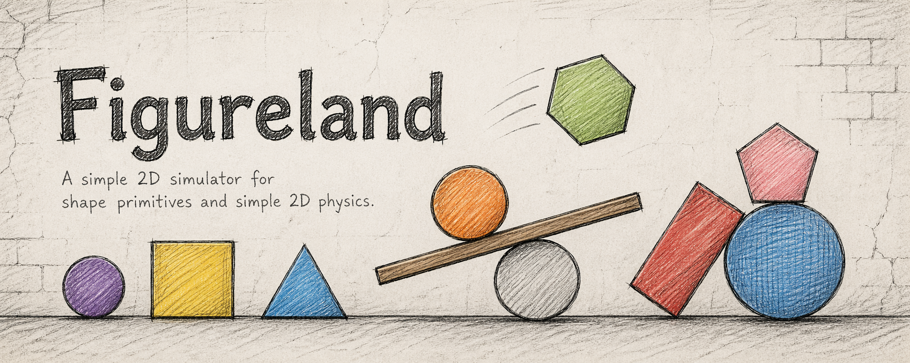
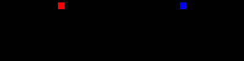

# Figureland

[](https://opensource.org/licenses/MIT)
[](https://github.com/figureland/figureland)
[](https://www.python.org/downloads/)



High-performance dataset generator for testing vision architectures (I-JEPA, V-JEPA, ViT) sensitive to shape, size, resolution, and aspect ratios.

## Features

- **Pure PyTorch GPU acceleration** - All rendering and physics implemented as tensor operations
- **Deterministic generation** - Guaranteed reproducible output with seed management
- **Built-in train/val/test splitting** - Isolated seed domains for each split
- **Multiprocessing parallel generation** - Standard library only, no distributed frameworks
- **Multi-format output** - PNG, JPEG, TIFF, MP4, AVI, GIF, HDF5, Parquet, Avro
- **Physics simulation** - Gravity, friction, air resistance, collision detection/response
- **Cloud ready** - Stateless design for Modal, RunPod, and other GPU cloud platforms

## Installation

### Pip
```bash
pip install figureland
```

### UV (Recommended)
```bash
# Install directly
uv pip install figureland

# Or add to your project
uv add figureland
```

### Pyenv + UV Workflow
```bash
# Install and set Python version
pyenv install 3.10.13
pyenv local 3.10.13

# Initialize uv
uv venv
source .venv/bin/activate

# Install figureland
uv add figureland
```

### Development Installation
```bash
git clone https://github.com/figureland/figureland.git
cd figureland

# Pip
pip install -e ".[dev,cloud]"

# UV
uv pip install -e ".[dev,cloud]"
```

## Quick Start

### Command Line
```bash
# Basic generation
figureland

# Generate 1000 episodes in parallel
figureland parallel_generation=true n_episodes=1000

# Custom configuration
figureland resolution=[512,512] episode_length=200 batch_size=64
```

### Python API
```python
from figureland import DatasetGenerator
import hydra
from omegaconf import DictConfig

@hydra.main(version_base=None, config_path="config", config_name="config")
def main(cfg: DictConfig) -> None:
    generator = DatasetGenerator(cfg)
    episode = generator.generate_episode()
    print(f"Generated {episode['frames'].shape[0]} frames")

if __name__ == "__main__":
    main()
```

## Usage Examples

- `examples/basic_usage.py` - Basic generation and export examples
  
- `examples/falling_balls.py` - Falling balls physics simulation
  
- `examples/environment_shape_management.py` - Shape management and validation
  
- `examples/parallel_bouncing_balls.py` - Parallel simulation generation
  
- `examples/modal_deployment.py` - Modal cloud deployment with auto-scaling
- `examples/runpod_deployment.py` - RunPod GPU instance deployment

## Output Formats

| Format | Description | Example |
|--------|-------------|---------|
| PNG/JPEG/TIFF | Individual frame images |  |
| MP4/AVI/GIF | Video episodes |  |
| GIF | Animated episodes | - |
| HDF5 | Compressed batch storage | - |
| Parquet | Columnar ML pipeline optimized | - |
| Avro | Binary serialization | - |

## Architecture

```
figureland/
├── shapes/          # 2D primitives with batched rendering
├── physics/         # Physics engine and collision detection
├── rendering/       # Anti-aliased batch renderer
├── config/          # Pydantic validated configuration
├── parallel/        # Multiprocessing workers and seed management
├── output/          # Multi-format exporters
└── generator.py     # Main interface
```

## Performance

- Batch processing of up to 128 simultaneous episodes on T4 GPU
- 10,000+ frames per second on mid-range GPUs
- Linear scaling with CPU core count

## Validation

- Deterministic output verified across CPU, CUDA, and MPS
- Shape integrity and physics consistency checks
- Train/val/test split distribution validation

## License

MIT
